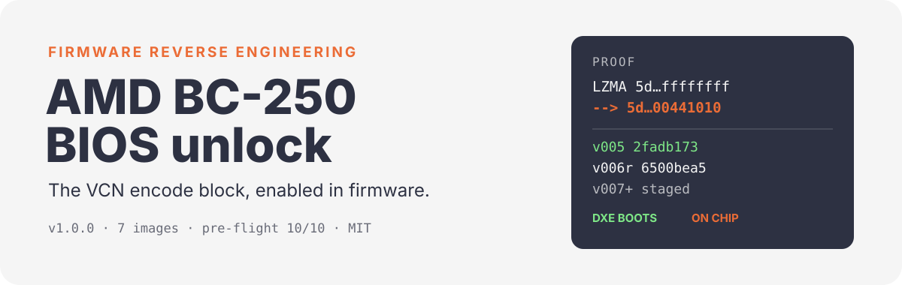
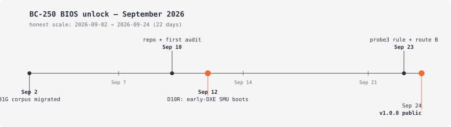

[English](README.md) | **Русский**

<p align="center">
  
</p>

<p align="center">
  <a href="https://github.com/kalpakprod/amd-bc250-bios-unlock/releases"></a>
  <a href="LICENSE"></a>
  <a href="https://github.com/kalpakprod/amd-bc250-bios-unlock"></a>
</p>

## Что это

- Проект включает блок кодирования VCN в BIOS платы ASRock BC-250.
- Метод: патчи UEFI/DXE, собственный DXE-драйвер, воспроизводимые сборщики
  образов, 10-гейтовый статический префлайт и безопасный протокол прошивки EEPROM.
- Каждое утверждение ниже проверено на реальном железе программатором.
- Статус на 2026-09-24: первопричина LZMA исправлена и подтверждена железом.
- Обе заглушки грузятся; оба полных образа встают. Хирургия и позиция закрыты:
  клин в операциях драйвера. Следующий — безопасный читатель.

## Прошивка может убить плату

- Каждый образ здесь экспериментальный.
- Для прошивки нужен аппаратный программатор (CH341/CH347 + прищепка SOIC).
- Для прошивки нужны полный проверенный дамп ВАШЕГО чипа и испытанный путь отката.
- Без пути отката не прошивай.
- Полная процедура: [docs/01-flash-protocol.md](docs/01-flash-protocol.md).

## Лесенка

Как читать имя файла:

- Имя файла говорит, что внутри: `FULL` выполняет весь драйвер, `STUB`
  грузится, но выполняет ноль аппаратных операций. Дальше — чем отличается,
  потом — где драйвер лежит.
- `early-slot` — вставлен среди первых DXE-драйверов. `appended-at-end` —
  дописан после последнего драйвера тома.
- Старый тег `vNN` живёт только как алиас в скобках и внутри каждого
  `.build.json`. Никогда как первичное имя.
- Ступень — это образ плюс его вердикт. Вердикты: `flashed` (пробовали на
  плате), `staged` (собран и статически проверен, на железе не был), `on chip`
  (прошит, вердикт ждём), `hangs` (пробовали, плата встала).

Ступени (образы, манифесты и `.txt`-карточки — в [Releases](https://github.com/kalpakprod/amd-bc250-bios-unlock/releases)):

- **BC250_vcn-driver-FULL_lzma-BROKEN_early-slot.bin** (алиас v004,
  `98b9c2bd…`): полный драйвер со сломанным заголовком LZMA неизвестного
  размера. Доказывает класс зависания. Вердикт: прошит, встаёт после 1 моргания.
- **BC250_vcn-driver-FULL_lzma-FIXED_early-slot.bin** (алиас v005,
  `2fadb173…`): полный драйвер с 8-байтовым фиксом LZMA.
  Доказывает, что плата снова грузит DXE. Вердикт: прошит, встаёт после
  2 морганий, без LAN и видео.
- **BC250_vcn-driver-STUB_no-hw-ops_early-slot.bin** (алиас v006r-noop,
  `6500bea5…`): контрольная заглушка. Отделяет вину драйвера от вины
  хирургии тома. Вердикт: прошит, ЗАГРУЖАЕТСЯ в Linux (amdgpu поднялся).
- **BC250_vcn-driver-FULL_lzma-FIXED_appended-at-end.bin** (алиас v007-active,
  `9d249397…`): тест позиции. Доказал, что дело не в позиции.
  Вердикт: прошит, встаёт после 1 моргания (до диспетча; том статически валиден).
- **BC250_vcn-driver-STUB_no-hw-ops_appended-at-end.bin** (алиас v007r-noop,
  `0133a34b…`): дописанный контроль. Доказал, что дописка в порядке.
  Вердикт: прошит, ЗАГРУЖАЕТСЯ (H19 победила).
- **BC250_vcn-driver-FULL_safe-reads-only_appended-at-end.bin** (алиас
  v008-secure, `c935e3ec…`): безопасный читатель. Проверяет, были ли клином
  сырые чтения. Вердикт: на полке, СЛЕДУЮЩИЙ.
- **BC250_vcn-driver-FULL_deferred-to-readyboot_appended-at-end.bin** (алиас
  v009-rtb, `56df6244…`): отложенный запуск. Проверяет время диспетча.
  Вердикт: на полке, шьём если безопасный встанет.

## Воспроизвести за 5 минут (без железа)

- Скачай вложения свежего релиза (как минимум образ BROKEN).
- Пересобери образы FIXED и STUB байт-в-байт:

```sh
PYTHONPATH=tools python3 tools/build_FULL_lzma_fixed_early_slot.py
# -> 2fadb173251eb4a44aa9da371f37207efb0f276f8d509926083bfa5a64c03406
PYTHONPATH=tools python3 tools/build_STUB_no_hw_ops_early_slot.py
# -> 6500bea5b01ea1dcc540939d65faa9cc0ec0f2505a5fcb3e358622803b85bb27
```

- Посмотри, как BROKEN ВАЛИТ гейт LZMA префлайта, а FIXED проходит:

```sh
python3 tools/verify_candidate_preflight.py --help
```

- Со своим дампом 16 МиБ (`BC250_BASE`, `BC250_PRE_SHA`) сборщики дописывания
  дописывания работают против ТВОЕЙ базы.
- Чужие дампы не шей никогда: NVRAM и данные платы различаются.

## Масштаб работы

- Работаем с 2026-09-02 (первое сообщение): идёт 23-й день ежедневной работы.



- Собрано: 60+ образов прошивок, 10+ проверенных циклов прошивки, каждый с
  независимым обратным чтением.
- Написано: 60+ скриптов сборки/парсинга/проб, гейт из 83 тестов, 350+
  исследовательских заметок, 400+ датированных записей лабораторного журнала.
- Цепочка на образ: статический префлайт, контрактный прогон OVMF, прошивка,
  обратное чтение, вердикт холодной загрузки. Ничего не называется готовым без доказательств.

## Откуда взялись идеи

- Сама плата уже несёт DXE-драйверы сообщества (`MeiMeiDXEv3_SMU_Core_Unlock`,
  `SMU_Patch`) в нашем классе размеров. Драйверы разблокировки внутри UEFI на
  этой самой плате — доказанная почва.
- Кампании SMU серии D (d5–d19) доказали три факта: раннее касание SMU в DXE
  грузится (D10R), заголовок LZMA неизвестного размера убивает загрузку
  (D5–D7, исправлено в D8), одиночные записи гаскета клинят SMU (D12–D19).
- Пробы USB/Linux (probe1–probe4) доказали одно правило: сырое чтение
  `0xB8/0xBC` набора клок-плана/SMU клинит плату даже после полной
  инициализации. Поэтому наш драйвер сырым трогает только адреса почтового
  ящика, а всё остальное читает через Q3 `0x2A`.
- Сообщество разметило территорию первым:
  [bc250-collective/amd_smu_reverse_engineering](https://github.com/bc250-collective/amd_smu_reverse_engineering),
  [thelamer/bc250-vcn](https://github.com/thelamer/bc250-vcn),
  [Shalasere/bc250-vcn-research](https://github.com/Shalasere/bc250-vcn-research),
  [MTSistemi/bc250-vaapi](https://github.com/MTSistemi/bc250-vaapi),
  [Hexxeh/bc250-efi-core-unlock](https://github.com/Hexxeh/bc250-efi-core-unlock).

## Во что упёрлись (стена, честно)

- **Зависание на LZMA неизвестного размера.** Наш перепаковщик капсулы (Python
  `lzma`, `FORMAT_ALONE`) писал в заголовок размер `0xFFFFFFFFFFFFFFFF`.
  Декодер PEI платы отвергает неизвестный размер, и том DXE не грузится.
  Симптом: первое моргание, потом ничего, до запуска любого драйвера.
  Исправлено 8 байтами в сборке FIXED; вся история: [docs/05-lzma-lesson.md](docs/05-lzma-lesson.md).
- **Лесенка клина DXE.** Когда DXE грузится, плата встаёт до видео и LAN.
  Подозреваемые по порядку проверки: код драйвера против хирургии тома, затем
  позиция, затем сырые чтения, затем тайминг. Каждая ступень меняет ровно одну переменную.
- **Позиция диспетча.** Наш первый слот был ПЕРВЫМ драйвером TRUE-пула, раньше
  PCI, видео, LAN и всех DXE чипсета AMD. `DEPEX TRUE` ничего не меняет против
  отсутствия DEPEX (спецификация PI); одинаковые зависания SUPERSEDED-v003e/BROKEN это
  доказали. Карта: [docs/02-uefi-layout.md](docs/02-uefi-layout.md).

## Раскладка

- `tools/` — воспроизводимые сборщики, 10-гейтовый префлайт, OVMF-стенд
  драйвера и постфлэш-проверка VCN. Начни отсюда:
  [tools/README.md](tools/README.md).
- `src/Bc250VcnUnlockDxe/` — исходники DXE-драйвера (route-B, secure,
  ReadyToBoot) плюс рецепт сборки EDK2.
- `docs/` — протокол прошивки, раскладка UEFI, набор записей драйвера, метод
  проверки VCN, урок LZMA и гайд по ядрам Linux.
- `kernels/` — сборки bore-vcn + bc250: режимы, дельта патчей, установщик.
- `CHANGELOG.md` — все релизы и правила версионирования.

## Чем нам помочь

- **Клином DXE.** Сборка FIXED встаёт до видео и LAN. Анализ набора записей против
  владельцев — в `docs/03-route-b-driver.md`. Вторая пара глаз на механизм
  конкуренции SMU (или UART-мод для POST-кодов) нас разблокирует.
- **VCN на стороне Linux.** Когда ступень загрузится,
  `tools/postflash_vcn_check.py` рассудит железо. Проверь 16 маркеров и путь
  привязки amdgpu/VCN.
- **Тестеры с железом.** Владельцы BC-250 со SPI-программатором, которые шьют
  ступени с полки с обратным чтением. Лесенка спроектирована ровно под это.
- **История.** У нас 60+ старых образов (серия D, OC, APCB) с тонкими
  манифестами. Помощь: связать сироту со скриптом и вердиктом.
- Контакт: issues этого репозитория. PR принимают скрипты и доки; полные дампы
  отклоняет `.gitignore`.

## Лицензия и отказ от ответственности

- Код и доки — MIT.
- Образы 16 МиБ также содержат вендорную прошивку (блобы AMI/AGESA/PSP)
  донорской платы. Считай их исследовательскими артефактами для железа,
  которым владеешь, без гарантий.
- Прошивка может убить плату, поэтому путь отката из
  [docs/01-flash-protocol.md](docs/01-flash-protocol.md) обязателен, а не опционален.
